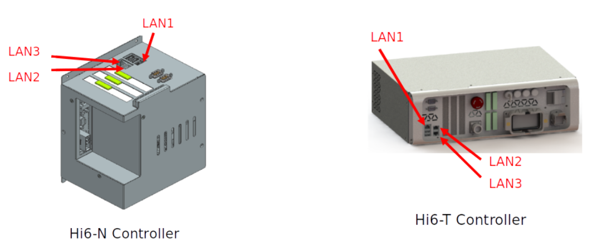
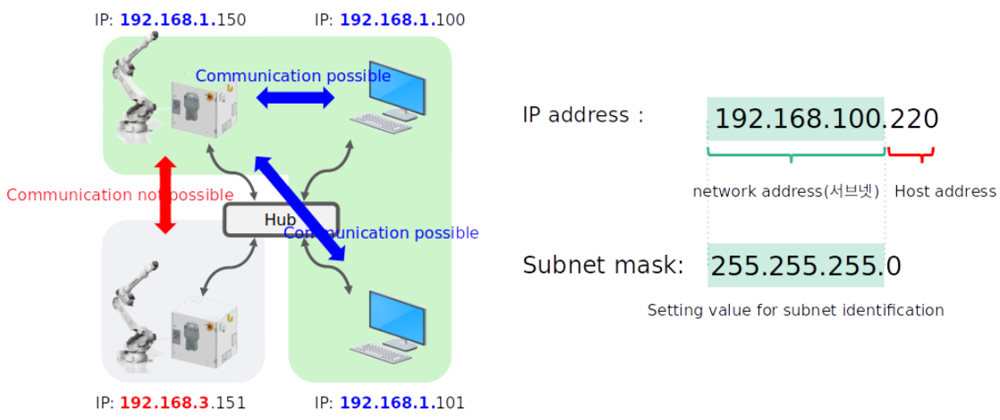
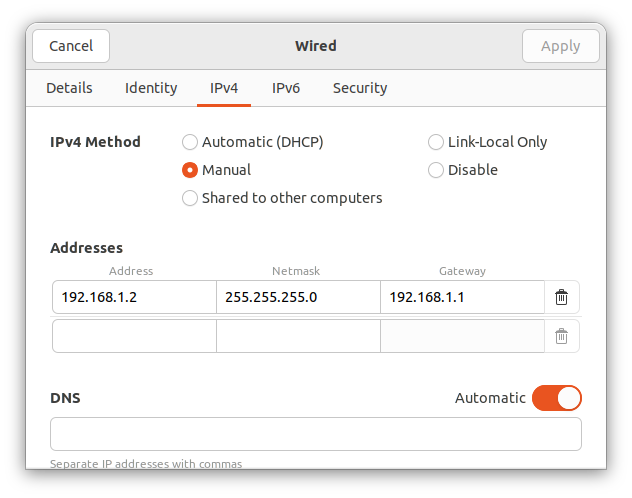
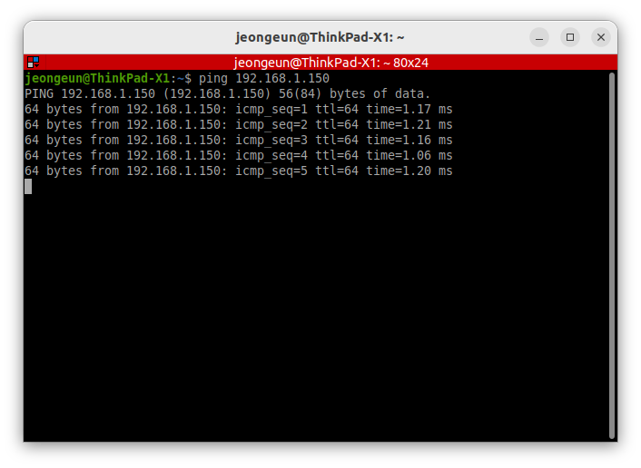

# 2.3 控制器与 PC 通信设置

本指南涵盖了您开发 PC 上网络接口的配置，以便与 HD Hyundai Robotics 机器人控制器进行通信。

### 前提条件
⚠️ 在开始设置之前，请验证以下内容：
- **机器人控制器软件版本**：Hi6、Hi7 系列控制器，软件版本为 **60.32-00** 或更高

### 网络配置概述

PC 必须配置为通过以太网与机器人控制器通信。默认配置使用 192.168.1.x 子网，控制器地址为 192.168.1.150。

### 默认网络配置（使用 LAN1）

| 组件 | 参数 | 默认值 |
|-----------|-----------|---------------|
| **PC IP 地址** | 静态 IP | 192.168.1.x (用户配置) |
| **机器人控制器 IP** | 静态 IP | 192.168.1.150 |
| **子网掩码** | 网络掩码 | 255.255.255.0 |
| **网关** | 默认网关 | 192.168.1.1  |

### 电缆连接



1. **找到机器人控制器以太网端口**
   - **Hi6-N 控制器**：主模块顶部的以太网端口
   - **Hi6-T 控制器**：控制器前面板的以太网端口

2. **连接以太网电缆**
   - 使用 Cat5e 或 Cat6 以太网电缆
   - **建议**：使用 LAN1（通常预配置为 192.168.1.x）
   - LAN2、LAN3 端口也可用，具有不同的默认控制器 IP： </br>
      LAN2: 192.168.4.150 → PC 需要配置为 192.168.4.x 范围 </br>
      LAN3: 192.168.3.150 → PC 需要配置为 192.168.3.x 范围

3. **验证物理连接**
   - 确保电缆连接牢固
   - 检查网络端口 LED 指示灯（如果可用）

### PC 网络接口配置



#### 使用网络管理器 GUI

##### Ubuntu 桌面 (GNOME)

1. **打开网络设置**
   - 点击右上角的网络图标
   - 选择“有线设置”或转到设置 → 网络

2. **配置有线连接**
   - 点击有线连接旁边的齿轮图标
   - 导航到“IPv4”标签

3. **设置静态IP配置（使用LAN1）**
   - **方法**：手动
   - **地址**：192.168.1.100
   - **子网掩码**：255.255.255.0
   - **网关**：192.168.1.1

4. **应用设置**
   - 点击“应用”，然后断开再重新连接网络接口



### 验证

#### 验证网络配置

```bash
# 测试网络连通性
ping -c 4 192.168.1.150
```

