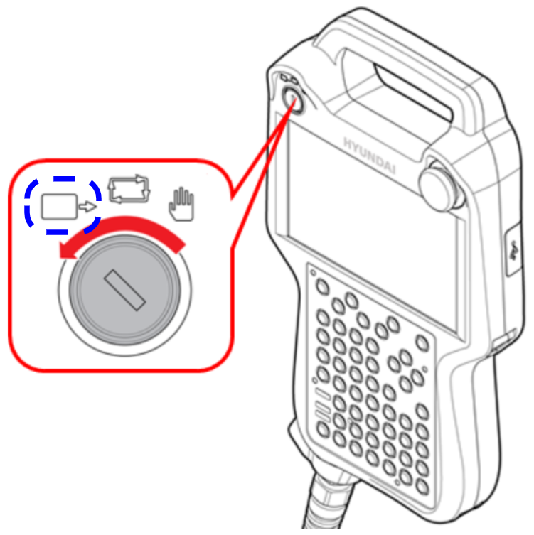

# 2.4 설치 검증

본 가이드는 HD현대로보틱스 ROS2 드라이버가 올바르게 설치, 구성되고 작동할 준비가 되었는지 확인하는 검증 절차를 제공합니다.


#### 로봇 모드 설정

HDR ROS2 드라이버는 로봇이 **REMOTE** 모드일 때만 동작합니다.

티치 펜던트(TP)에서 모드 스위치를 REMOTE 위치로 전환하여 제어기를 원격 제어 모드로 설정한 후 ROS2 드라이버를 실행하시기 바랍니다.




#### HDR ROS2 드라이버 실행 테스트

```bash
# HDR ROS2 드라이버 실행 (로봇이 REMOTE 모드에 있는지 확인)
ros2 launch hdr_bringup hdr_control.py \
  robot_model:=hdf7_7      # 로봇 모델 입력 (default: ha006b)


# 다른 터미널에서 controller 매니저 확인
ros2 control list_controllers

# 예상 출력:
# joint_state_broadcaster[joint_state_broadcaster/JointStateBroadcaster] active
# joint_trajectory_controller[joint_trajectory_controller/JointTrajectoryController] active
```

#### joint state 발행 테스트

```bash
# joint state가 발행되고 있는지 확인
ros2 topic list | grep joint_states

# joint state 모니터링
ros2 topic echo /joint_states --once

# 발행 hz 확인
ros2 topic hz /joint_states
```
